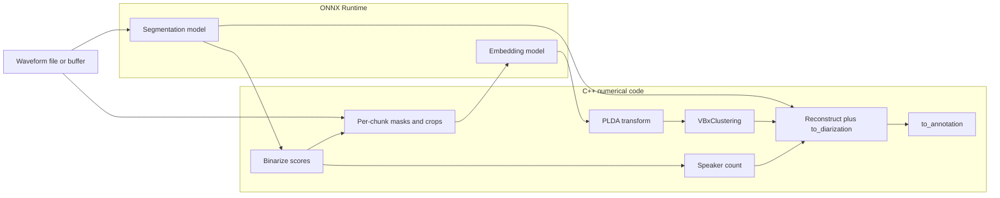

# C++ porting plan: `community-1` speaker diarization

This document maps the Python implementation in **pyannote-audio** (default checkpoint **`pyannote/speaker-diarization-community-1`**) to a planned C++ implementation that uses **ONNX Runtime** for neural models. It is the reference for a future `libdiarize` (or similar) plus tests; it does not prescribe directory names inside a C++ tree beyond suggested module boundaries.

**Scope:** `SpeakerDiarization.apply()` end-to-end for the default clustering **`VBxClustering`**, including overlapping diarization, exclusive diarization, and speaker centroids, matching ```530:784:src/pyannote/audio/pipelines/speaker_diarization.py```.

**Out of scope for this note:** training, pipeline hyper-parameter search, `OracleClustering`, cloud (`pyannoteai`) paths.

---

## Export scripts (delivered)

ONNX export for the C++ port lives under **`cpp/scripts/`**:

| Script | Purpose |
|--------|---------|
| `export_segmentation_onnx.py` | Loads HF segmentation weights (default: `pyannote/speaker-diarization-community-1` + `segmentation/`), wraps **powerset → multilabel** like `Inference` (when applicable), exports ONNX + JSON metadata. Extends the idea of [pyannote-onnx `export_onnx.py`](https://github.com/pengzhendong/pyannote-onnx/blob/master/export_onnx.py). |
| `export_embedding_onnx.py` | Loads HF embedding weights (`embedding/` subfolder), exports **`fbank` + `weights`** (Kaldi log-fbank from `compute_fbank` stays outside ONNX; matches `EmbeddingFbankOnnxWrapper`). |
| `verify_onnx_parity.py` | Torch vs ONNX Runtime on CPU for exported segmentation and embedding graphs. |
| `embedding_golden_test` (C++) | ORT `community1-embedding.onnx` vs `embedding_chunk0_spk0_ort.npz`. |
| `speaker_count_golden_test` (C++) | Pure post-net: trim + sum + aggregate vs `speaker_count_initial.npz`; then `np.minimum(..., max_speakers)` vs `speaker_count_capped.npz` (reads **`golden_speaker_bounds.json`** when present; else no cap). |
| `reconstruct_golden_test` (C++) | `reconstruct` (per-chunk max over cluster members) + `to_diarization` (`Inference.aggregate` `skip_average=True`, extent crop, top-`count` speakers) vs **`discrete_diarization_overlap.npz`** / **`discrete_diarization_exclusive.npz`**. |
| `annotation_golden_test` (C++) | `Binarize` / `to_annotation` (onset/offset 0.5, frame middles) + **`label_mapping.json`** vs **`diarization.json`** / **`exclusive_diarization.json`**. |
| `dump_diarization_golden.py` | Full **`SpeakerDiarization.apply()`** control flow; writes NPZ/JSON bundles for C++ parity (see §11). |
| `cpp-annote-cli` (C++) | **WAV** + segmentation ORT + ORT embedding + VBx (PLDA) → **`diarization.json`**. |
| `fetch_callhome_example_wav.py` | Saves one clip from **`diarizers-community/callhome`** (split **`data`** in current HF revision) for **`dump_golden.sh`**. |

Install extras: `pip install -e ".[export]"` (see `pyproject.toml`). Requires Hugging Face access to the gated model; set **`HF_TOKEN`** in the environment.

See **`cpp/scripts/README.md`** for usage (`scripts/export.sh`, `scripts/dump_golden.sh`).

---

## 1. End-to-end dataflow (Python reference)



---

## 2. Pipeline stage → Python source → proposed C++ module

| Stage | Role | Primary Python | Proposed C++ module / type |
|-------|------|----------------|----------------------------|
| Entry | Load checkpoint config, durations, step, hyperparameters | `SpeakerDiarization.__init__`, `Pipeline.from_pretrained` (HF) | `DiarizationConfig` (loaded from YAML + constants matching `default_parameters`) |
| Segmentation | Sliding-window forward, no overlap-add of scores | `get_segmentations` → `Inference` ```305:329:src/pyannote/audio/pipelines/speaker_diarization.py```, ```217:287:src/pyannote/audio/core/inference.py``` | `SegmentationEngine` wrapping ORT session; `SlidingWindowChunker` mirroring `Inference.slide` |
| Post-seg (optional) | Powerset → multilabel if model uses powerset | `Inference` conversion ```126:141:src/pyannote/audio/core/inference.py``` | **Baked into ONNX** by `cpp/scripts/onnx_wrappers.py` (`SegmentationInferenceWrapper`), or a separate `PowersetDecoder` in C++ if you export raw logits |
| Binarize | Hysteresis on logits (if not powerset pass-through) | `binarize` ```598:606:src/pyannote/audio/pipelines/speaker_diarization.py```, ```44:120:src/pyannote/audio/utils/signal.py``` | `BinarizeScores` |
| Speaker count | Trim chunk edges, aggregate sum, round | `speaker_count` ```149:185:src/pyannote/audio/pipelines/utils/diarization.py```, `Inference.trim` / `Inference.aggregate` ```499:620:src/pyannote/audio/core/inference.py``` | `SpeakerCounter` (depends on `Aggregation`, `Trim`) |
| Embeddings | Crop/pad waveform per chunk; optional overlap mask; batch to model | `get_embeddings` ```332:478:src/pyannote/audio/pipelines/speaker_diarization.py```, `Audio.crop` ```406:410:src/pyannote/audio/pipelines/speaker_diarization.py``` | `AudioCropper` + `EmbeddingEngine` (ORT); mask shape **`(batch, num_frames)`** matching export |
| PLDA | x-vector → PLDA space for VBx | `PLDA` ```33:64:src/pyannote/audio/core/plda.py```, `vbx_setup` ```181:218:src/pyannote/audio/utils/vbx.py``` | `PldaModel` (loads `xvec_transform.npz`, `plda.npz`; Eigen for matmul / `eigh` equivalent) |
| Clustering | Filter → AHC → VBx → optional KMeans → assign | `VBxClustering.__call__` ```550:669:src/pyannote/audio/pipelines/clustering.py```, `cluster_vbx` / `VBx` ```140:156:src/pyannote/audio/utils/vbx.py``` | `VbxClustering` (depends on `LinkageAhc`, `VbxInference`, `KMeansLite`, `HungarianAssignment`) |
| Reconstruct | Map local speakers to global clusters; combine with count | `reconstruct` ```480:528:src/pyannote/audio/pipelines/speaker_diarization.py```, `to_diarization` ```220:268:src/pyannote/audio/pipelines/utils/diarization.py``` | `DiarizationReconstructor` |
| Rasterize | Frame matrix → contiguous segments | `to_annotation` ```187:218:src/pyannote/audio/pipelines/utils/diarization.py```, `Binarize` (pyannote.core path) | `DiscreteToAnnotation` (same onset/offset/min_duration rules) |
| Exclusive | Cap per-frame speaker count at 1 | `apply` ```701:713:src/pyannote/audio/pipelines/speaker_diarization.py``` | Same `DiarizationReconstructor` with modified `count` |
| Labels | Integer labels → `SPEAKER_XX` | `apply` ```732:740:src/pyannote/audio/pipelines/speaker_diarization.py```, `classes()` | `SpeakerLabelFormatter` |

---

## 3. Type and tensor mapping

### 3.1 Core Python types → C++ structs

| Python | Meaning | C++ counterpart (suggested) |
|--------|---------|-----------------------------|
| `AudioFile` | Path or `{waveform, sample_rate}` map | `struct AudioSource { std::vector<float> waveform; int sample_rate; int channels; std::optional<std::string> uri; }` plus file loader |
| `SlidingWindow` (`pyannote.core`) | `start`, `duration`, `step` in seconds | `struct SlidingWindow { double start, duration, step; }` |
| `SlidingWindowFeature` | `data` ndarray + `sliding_window` | `struct SlidingWindowFeature { Eigen::MatrixXf data; SlidingWindow window; }` — layout: rows = time frames, cols = classes/speakers unless chunk dimension is explicit (see below) |
| Chunked segmentations | `(num_chunks, num_frames, num_speakers)` | `Eigen::Tensor<float, 3>` or `std::vector<Eigen::MatrixXf>` with documented row-major layout matching NumPy |
| `DiarizeOutput` | Three fields | `struct DiarizeOutput { Annotation overlapping; Annotation exclusive; Eigen::MatrixXf centroids; }` |
| `Annotation` | intervals + labels | `std::vector<struct Turn { double start, end; std::string label; }>` or thin wrapper around interval tree if needed |

**Layout parity:** NumPy `SlidingWindowFeature.data` shapes and axis order used in `apply` must be frozen in the architecture (document chunk-major vs frame-major). Golden tests should dump NumPy arrays as row-major NPZ for C++ to load verbatim.

### 3.2 Neural I/O (ORT)

| Model | Python source | Exported ONNX (this repo) | Typical ORT outputs |
|-------|----------------|---------------------------|---------------------|
| Segmentation | Torch `Model` inside `Inference` ```198:215:src/pyannote/audio/core/inference.py``` | Input **`waveforms`**: `(B, 1, T)` float32; output **`segmentation`**: multilabel **hard** `(B, frames, classes)` when powerset (matches `Powerset.forward` in export wrapper) | Per-chunk frame activations |
| Embedding | `PyannoteAudioPretrainedSpeakerEmbedding` / WeSpeaker `resnet` ```704:716:src/pyannote/audio/pipelines/speaker_verification.py``` | Inputs **`fbank`** `(B, T_f, M)`, **`weights`** `(B, T_f)` (`1` = keep frame); fbank = `compute_fbank(waveforms)` in host code | **`embedding`** `(B, D)` |

Exact shapes for `T` and `F` for a given waveform length are recorded in the sidecar JSON produced by the export scripts.

### 3.3 Static matrices (not ONNX)

| File (HF `plda/` subfolder) | Loaded in Python by | C++ |
|-----------------------------|----------------------|-----|
| `xvec_transform.npz` | `vbx_setup` → keys `mean1`, `mean2`, `lda` ```195:196:src/pyannote/audio/utils/vbx.py``` | Same keys; store as `Eigen::VectorXf` / `Eigen::MatrixXf` |
| `plda.npz` | `mu`, `tr`, `psi` ```198:199:src/pyannote/audio/utils/vbx.py``` | Same; generalized eigen decomposition done once at load (same as Python reordering) |

---

## 4. Detailed mapping: orchestration

| Python | C++ |
|--------|-----|
| `SpeakerDiarization` | `Community1Diarizer` (orchestrator): holds config, ORT sessions, PLDA, clustering hyperparameters (`threshold`, `Fa`, `Fb`, `min_duration_off`) ```289:293:src/pyannote/audio/pipelines/speaker_diarization.py``` |
| `set_num_speakers` ```34:69:src/pyannote/audio/pipelines/utils/diarization.py``` | `validateSpeakerBounds()` — same rules for `num_speakers` / `min_speakers` / `max_speakers` |
| Early exit when no speech ```618:628:src/pyannote/audio/pipelines/speaker_diarization.py``` | Same branch: empty annotations, zero-row centroids |

---

## 5. Detailed mapping: audio and windows

| Python | C++ |
|--------|-----|
| `Audio(sample_rate=..., mono="downmix")` used with embedding model ```264:264:src/pyannote/audio/pipelines/speaker_diarization.py``` | Resampler + mono mix; target rate = embedding model sample rate from config |
| `Audio.crop(file, chunk, mode="pad")` ```406:410:src/pyannote/audio/pipelines/speaker_diarization.py``` | Time-aligned crop with zero-padding to chunk length |
| `Inference.slide` chunking and last-chunk pad ```260:278:src/pyannote/audio/core/inference.py``` | Identical sample counts: `window_size`, `step_size`, pad right for partial tail |

---

## 6. Detailed mapping: segmentation post-processing

| Python | C++ |
|--------|-----|
| `Inference.aggregate` (Hamming, warm-up, skip_average) ```499:620:src/pyannote/audio/core/inference.py``` | Same loop over chunks: frame index via `frames.closest_frame`, accumulation, divide unless `skip_average` |
| `Inference.trim` ```622:627:src/pyannote/audio/core/inference.py``` | Same warm-up ratios as `speaker_count` caller `(0.0, 0.0)` vs defaults — **must match** ```609:613:src/pyannote/audio/pipelines/speaker_diarization.py``` |
| `binarize` on `SlidingWindowFeature` | Dispatch on type; preserve NaN semantics where Python uses them for stitching |

---

## 7. Detailed mapping: embeddings loop

| Python | C++ |
|--------|-----|
| `iter_waveform_and_mask` / `batchify` ```399:433:src/pyannote/audio/pipelines/speaker_diarization.py``` | Iterator yielding `(waveform_chunk, mask_per_speaker)` pairs batched to ORT |
| `exclude_overlap` branch ```375:397:src/pyannote/audio/pipelines/speaker_diarization.py``` | Same `clean_frames` logic and `min_num_frames` from `min_num_samples` |
| `np.nan_to_num` on masks ```414:415:src/pyannote/audio/pipelines/speaker_diarization.py``` | Same |
| `PretrainedSpeakerEmbedding` → Torch forward with `weights` ```711:715:src/pyannote/audio/pipelines/speaker_verification.py``` | Compute **fbank** from chunk waveform (same as Python `compute_fbank`), then ORT **`fbank` + `weights`**; interpolate mask from segmentation frames to **fbank frame count** `T_f` in C++ (Torch `interpolate` in Python) |

---

## 8. Detailed mapping: `VBxClustering`

| Python | C++ |
|--------|-----|
| `filter_embeddings` ```77:125:src/pyannote/audio/pipelines/clustering.py``` | Same masks: `single_active_mask`, `num_clean_frames`, `active`, `valid` |
| `linkage` + `fcluster` (centroid, Euclidean on L2-normalized rows) ```596:604:src/pyannote/audio/pipelines/clustering.py``` | Hierarchical clustering with same linkage — use scipy-compatible algorithm or call Python once in golden generation only; runtime C++ needs a verified port |
| `self.plda(train_embeddings)` ```608:608:src/pyannote/audio/pipelines/clustering.py``` | `PldaModel::transform` |
| `cluster_vbx` ```609:616:src/pyannote/audio/pipelines/clustering.py``` | Port of `VBx` + softmax init ```27:156:src/pyannote/audio/utils/vbx.py``` (depends on `logsumexp`, `softmax`, iterative updates) |
| Centroids from responsibilities ```619:620:src/pyannote/audio/pipelines/clustering.py``` | Same sparse column selection `sp > 1e-7` |
| Optional `KMeans` ```631:642:src/pyannote/audio/pipelines/clustering.py``` | Same `n_clusters`, `n_init=3`, `random_state=42` for reproducibility |
| `cdist` + metric `self.metric` (cosine) ```645:655:src/pyannote/audio/pipelines/clustering.py``` | Pairwise distances, `soft_clusters = 2 - distance` |
| `constrained_argmax` / Hungarian ```658:664:src/pyannote/audio/pipelines/clustering.py``` | Per-chunk `linear_sum_assignment` maximize — C++ Hungarian solver |
| Inactive speakers → cluster `-2` ```680:685:src/pyannote/audio/pipelines/speaker_diarization.py``` | Same |
| `count` cap by `max_speakers` ```676:676:src/pyannote/audio/pipelines/speaker_diarization.py``` | Same |

---

## 9. Detailed mapping: reconstruction and output

| Python | C++ |
|--------|-----|
| `reconstruct` max over cluster members ```503:527:src/pyannote/audio/pipelines/speaker_diarization.py``` | Same loop over `np.unique(cluster)` skipping `-2` |
| `to_diarization` top-`c` speakers per frame ```261:267:src/pyannote/audio/pipelines/utils/diarization.py``` | Same `argsort` ordering |
| `to_annotation` with `Binarize` ```211:218:src/pyannote/audio/pipelines/utils/diarization.py``` | Same onset/offset 0.5 and `min_duration_on` / `min_duration_off` |
| Centroid reorder to label order ```768:773:src/pyannote/audio/pipelines/speaker_diarization.py``` | Same `inverse_mapping` |

---

## 10. External repositories and artifacts

| Artifact | Relation to this map |
|----------|----------------------|
| [pyannote-onnx](https://github.com/pengzhendong/pyannote-onnx) | Reference for minimal `torch.onnx.export` of `Model`; this repo’s **`export_segmentation_onnx.py`** adds **powerset handling**, metadata, and HF **`community-1`** defaults. |
| HF `pyannote/speaker-diarization-community-1` | Source of `config.yaml`, `segmentation/`, `embedding/`, `plda/`; token-gated download. |
| ONNX embedding | **`export_embedding_onnx.py`** exports **`fbank` + `weights`**; C++ runs the same fbank recipe as `compute_fbank`, then ORT. |

---

## 11. Testing hooks (Python symbol → golden artifact)

Use **`cpp/scripts/dump_diarization_golden.py`** (or **`scripts/dump_golden.sh`**) to generate a bundle without modifying library code. Per-utterance folder layout:

| Boundary | Artifact in bundle | Consumer |
|----------|--------------------|----------|
| After `get_segmentations` | `segmentations.npz`, **`first_chunk_waveform.npz`** | C++ `SegmentationEngine` integration test (ORT input for chunk 0) |
| After binarize | `binarized_segmentations.npz` | `BinarizeScores` |
| After `speaker_count` | `speaker_count_initial.npz`, **`speaker_count_capped.npz`**, **`golden_speaker_bounds.json`** (resolved `max_speakers`; `null` = no cap) | C++ `speaker_count_golden_test` (initial + capped vs golden) |
| After `get_embeddings` | `embeddings.npz`, **`embedding_chunk0_spk0_ort.npz`** (`fbank`, `weights`, `expected_embedding`) | `EmbeddingEngine` + ORT parity |
| After `clustering` | `clustering.npz` (`hard_clusters`, `soft_clusters`, `centroids`) | `VbxClustering` |
| After inactive reassignment | `hard_clusters_final.npz` | `reconstruct` input |
| After `reconstruct` / `to_annotation` | `discrete_diarization_*.npz`, `diarization.json`, **`label_mapping.json`** | **`reconstruct_golden_test`** + **`annotation_golden_test`** |
| Root | `manifest.json`, `pipeline_snapshot.json`, `receptive_field.json` | Versions and hyperparameters |

For closing the **embedding + VBx** gap vs Python in the C++ diarization path (logging, ordered tests, milestones), see **`cpp/embedding-vbx-parity-plan.md`**. Milestone 0 (frozen NPZ layout) is enforced by **`cpp/build/frozen_golden_inputs_test`**.

---

## 12. Configuration surface (must match Python defaults)

Document in `DiarizationConfig` (single source for C++ and test generators):

- `segmentation_step` (default `0.1`) ```200:200:src/pyannote/audio/pipelines/speaker_diarization.py```
- `segmentation.min_duration_off` (default `0.0`) ```291:291:src/pyannote/audio/pipelines/speaker_diarization.py```
- `segmentation.threshold` only if non-powerset (from tuned `config.yaml` on HF, not hardcoded in `speaker_diarization.py`)
- Clustering: `threshold`, `Fa`, `Fb` ```292:292:src/pyannote/audio/pipelines/speaker_diarization.py```
- `embedding_exclude_overlap` (default `False`) ```205:205:src/pyannote/audio/pipelines/speaker_diarization.py```
- Model-derived: chunk duration, receptive field / `SlidingWindow` for frames, embedding dimension, sample rates

---

## 13. Revision history

| Date | Change |
|------|--------|
| 2026-04-13 | Initial architecture note for `community-1` C++ port. |
| 2026-04-13 | Moved to `cpp/porting-plan.md`; added export scripts section and ONNX I/O table. |
| 2026-04-13 | Added `cpp/scripts/export_*_onnx.py`, `onnx_wrappers.py`, and `[project.optional-dependencies] export`. |
| 2026-04-13 | Added `verify_onnx_parity.py` and wired it into `scripts/export.sh`. |
| 2026-04-13 | Added `dump_diarization_golden.py` and `scripts/dump_golden.sh` (golden trace bundles). |
| 2026-04-13 | C++ bootstrap: `cpp/CMakeLists.txt`, `segmentation_golden_test`, `scripts/build_cpp.sh`, `cpp/README.md`; golden bundles gain `first_chunk_waveform.npz`. |
| 2026-04-13 | `embedding_golden_test`, `embedding_chunk0_spk0_ort.npz` in golden dump. |
| 2026-04-13 | `speaker_count_golden_test`: C++ parity for frame-level speaker count vs golden NPZ. |
| 2026-04-14 | `speaker_count_golden_test` also checks **`speaker_count_capped.npz`**; dump writes **`golden_speaker_bounds.json`**. |
| 2026-04-14 | **`reconstruct_golden_test`**: C++ parity for `reconstruct` + `to_diarization` vs discrete diarization NPZs. |
| 2026-04-14 | **`annotation_golden_test`**: `Binarize` / `to_annotation` vs golden diarization JSON (+ label mapping). |
| 2026-04-14 | **`cpp/port/annotation_support.hpp`**: `Timeline.support` + `Annotation.support` (collar merge + second pass) for `min_duration_off` / golden parity. |
| 2026-04-14 | **`cpp-annote-cli`**: WAV + sliding segmentation ORT + VBx clustering → JSON; **`wav_pcm_float32.hpp`**; export JSON gains **`chunk_step_sec`**. |
